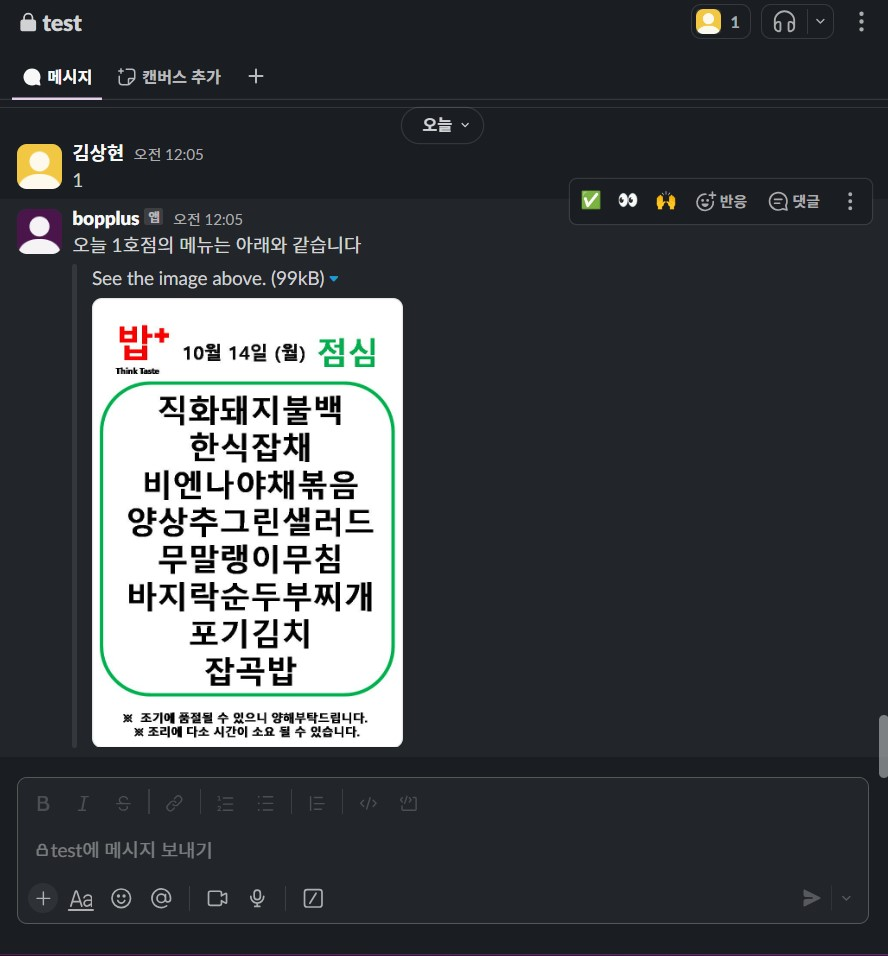
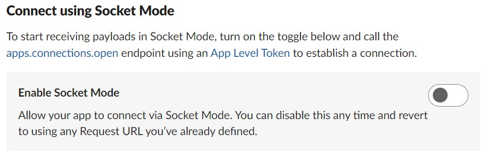
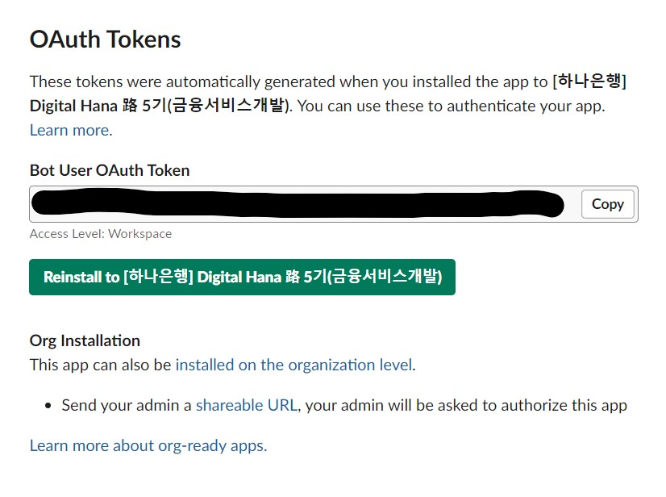
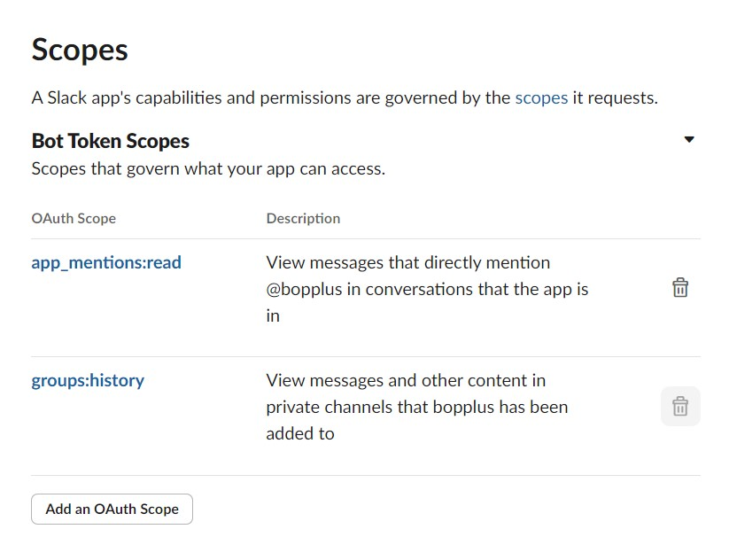
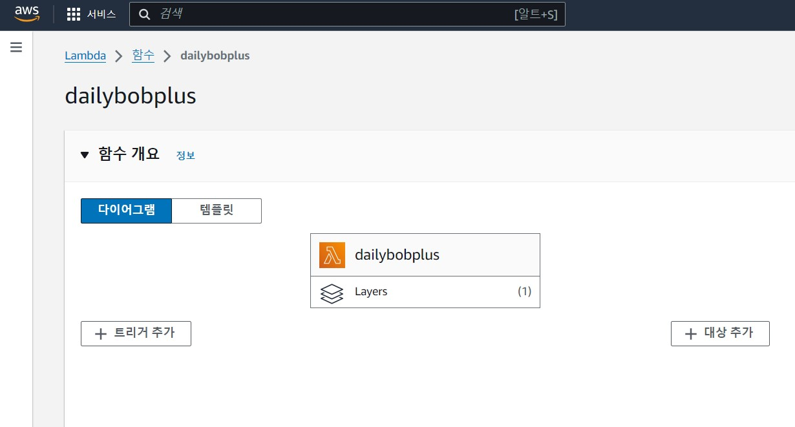
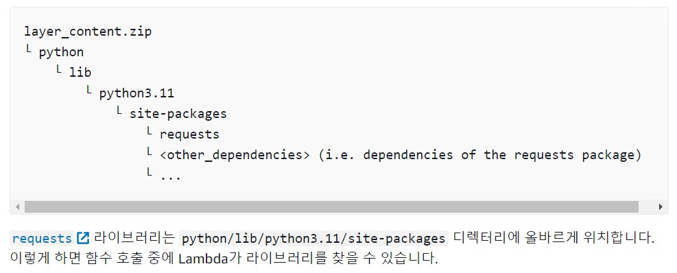

# dailybobplus 🍚

:fire: 디지털 하나로 5기 화이팅 :fire:
- Slack 앱 관리 페이지 : https://api.slack.com/apps/

### 🔧 How it works? 
1. Slack 채널에 앱(bot) 추가
2. **1, 4, 6** 중 하나를 입력(1호점, 4호점, 6호점)
3. 밥플러스 네이버 블로그에 게재된 오늘의 메뉴 사진을 크롤링하여 Slack bot이 사진과 함께 응답

## 📖 Abstract
### Socket Mode

- 로컬 환경에서 개발할 때 사용하는 모드
- 슬랙 앱에서 이벤트 발생 시 로컬 주소로 request를 보냄
- request url을 지정할 필요가 없음
- 다만 배포 시에는 request url을 지정 필요

### ngrok
- 로컬 개발 환경에서 실행 중인 웹 서버를 외부에서 접근할 수 있도록 만들어주는 도구
- 외부 접근이 가능한 서버 주소를 만들어 줌
- ngrok.exe 실행하여 커맨드 입력
> ngrok http 3000 -> local의 3000번 port로
- 커맨드 실행 시마다 주소가 바뀜 -> Event Subscription에서 request url 변경 필요

### OAuth & Permissions
- **Bot User OAuth Token** 발급 필요 : 소스 코드에 붙여 넣기

- 새로 발급 받을 때마다 앱 reinstall 필요
- **Bot Token Scopes** : channels:read, groups:history만 설정, 권한은 적당히

### AWS Lambda

- 서버리스 컴퓨팅 서비스, 코드를 실행할 수 있는 환경을 자동으로 관리
- 이벤트 기반 : 이벤트에 따라 코드를 실행(AWS 서비스(예: S3, DynamoDB, SNS) 또는 **HTTP 요청(API Gateway)**)
- lambda로 배포, 함수 등록
- 런타임 : **Python 3.9**
- 코드 소스에 앞서 만들었던 코드를 zip 파일로 압축하여 업로드
- 다만, 의존성(모듈) import는 되지 않는다 -> module 파일까지 같이 업로드 해야 함
  - 코드 소스에 함께 업로드 하기에는 파일이 너무 크다 -> **layer**를 하나 추가
  #### layer
  - 추가 리소스 - 계층 - 계층 추가 - 모듈들 zip 파일 업로드하고 생성
    - 런타임을 동일하게(Python 3.9)
    - **모듈 zip 파일 만들 때 정의된 디렉터리 계층 구조 준수!!!**
    - 
    - 그래야 lambda 함수가 라이브러리를 찾을 수 있음
    - [Python Lambda 함수를 위한 계층 작업 - AWS Lambda](https://docs.aws.amazon.com/ko_kr/lambda/latest/dg/python-layers.html)
  - 그리고 lambda 함수 설정 맨 하단에 계층에서 add layer - 사용자 지정 계층 - 이전에 만들었던 layer 선택하고 추가
  

## Problem / Solution
- Slack의 채팅창에 한 번만 요청하였는데, 여러 번의 event가 발생하여 여러 번의 메뉴 응답이 이루어지는 현상
- Slack은 event가 request 된 후 3초 이내로 200 ok response를 받지 않으면 request를 재시도함
- **lambda가 request에 3초 이내로 응답하지 못해** 발생하는 문제임을 추정
- lambda에 대한 개념을 다시 살펴보고 정립함
- 도움받은 링크 : [[AWS] 📚 람다 성능 개선 (Cold Start 해결) 전략 4가지](https://inpa.tistory.com/entry/AWS-%F0%9F%93%9A-%EB%9E%8C%EB%8B%A4-%EC%84%B1%EB%8A%A5-%EA%B0%9C%EC%84%A0-Cold-Start-%ED%95%B4%EA%B2%B0)

  
  > lambda는 서버리스, ec2처럼 항상 활성화되어 있지 않다, 요청이 없으면 꺼진 상태임  
  > request 들어오면? lambda 함수 실행 위해 부수적인 준비 필요하고 -> 이것이 수 초 ~ 수십 초 -> 꽤 오래 소요된다. -> lambda의 단점  
  > 상대적으로 느린 response : **Cold Start**  
  > 메모리를 늘리면? 성능 향상 -> 처리 속도가 빨라짐  
  > 기존의 메모리는 128MB -> **2048MB**로 상향 조정  
  > **메모리 상향으로 Slack의 request에 3초 이내로 응답하여 문제 해결**  

### lambda free tier
- 요청 당 돈이 부과 -> 너무 많이 요청하면 요금 부과되는 것 아닌가?
- lambda의 free tier는 **매우 관대함**, 사실상 무료
- **(메모리 별 가격) x (요청 처리 시간) x (요청 수)**
- 월 10만건, 2000ms, 2048MB 가정하여 계산해도 무료(최대한 넉넉하게 잡아도)
- [AWS Lambda 요금 계산기](https://calculator.aws/#/createCalculator/Lambda)
